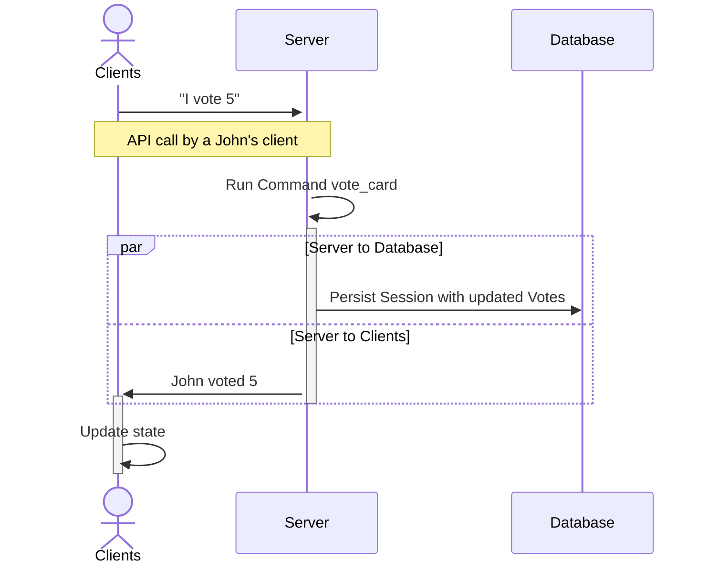
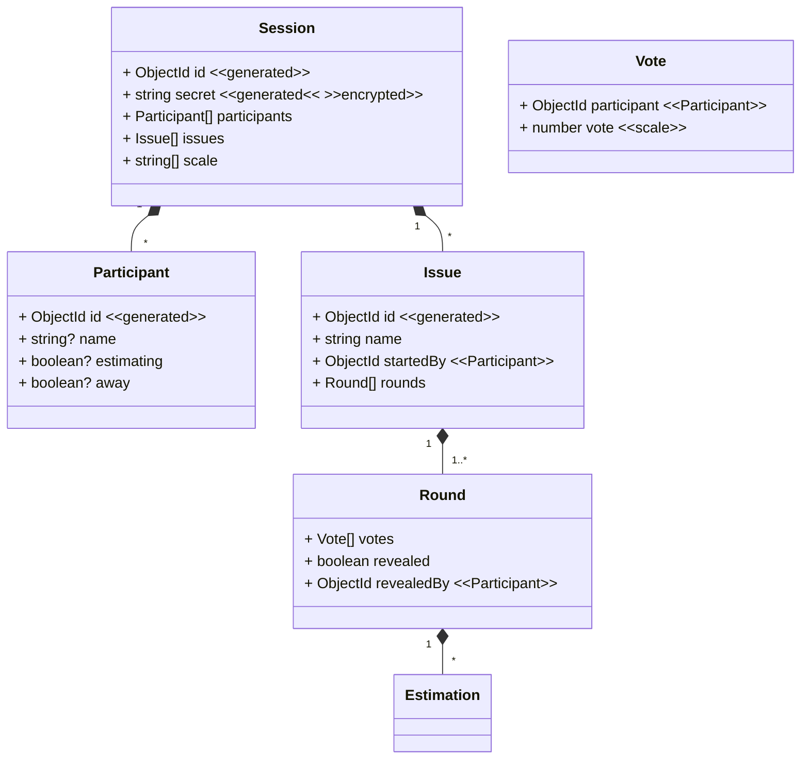

<a name="readme-top"></a>

[](https://japp.shuttleapp.rs)
[](https://github.com/yuri-becker/japp/stargazers)
[](https://github.com/yuri-becker/japp/blob/main/LICENSE.txt)

<h1 align="center">
 JAPP

</h1>

<ol>
<li>
  <a href="#about-the-project">About The Project</a>
  <ul>
    <li><a href="#built-with">Built With</a></li>
  </ul>
</li>
<li>
  <a href="#development">Development</a>
  <ul>
    <li><a href="#prerequisites">Prerequisites</a></li>
    <li><a href="#usage">Usage</a></li>
  </ul>
</li>
<li>
    <a href="#documentation">Documentation</a>
  <ul>
    <li><a href="#entities">Entities</a></li>
  </ul>
</li>
</ol>

## About The Project

So at my employer we do [Planning Poker](https://en.wikipedia.org/wiki/Planning_poker) remotely
~~and doing it on Miro sucks~~ and I was unhappy with the current platform we use. Looking for other, free (as in freedom) alternatives
I found none that really fits our case, so I decided to do my own.

So JAPP is basically a way of doing Planning Poker.

Why should you do Planning Poker? Ask your managers or something I guess.

Why should you use JAPP? Well, if you really have to do Planning Poker (remotely), JAPP should be an okay solution.

### Built With

#### Frontend

[](https://reactjs.org/)
[](https://pnpm.io)
[](https://reactjs.org/)
[](https://vitejs.dev)

... as well as [zustand](https://github.com/pmndrs/zustand), [jest](https://jestjs.io), [immer](https://immerjs.github.io/immer/) and
[wretch](https://github.com/elbywan/wretch).

#### Backend

[](https://www.rust-lang.org)
[](https://rocket.rs)
[](https://www.mongodb.com)

... and [okapi](https://crates.io/crates/okapi). Hosted on [shuttle](https://www.shuttle.rs)

~~the so-called MRRR stack~~

<p align="right">(<a href="#readme-top">back to top</a>)</p>

## Development

### Prerequisites

- [Node.js](https://nodejs.org/en/download/)
- [pnpm](https://pnpm.io/installation)
- [Rust & Cargo via rustup](https://www.rust-lang.org/tools/install)
- [A local MongoDB instance for development](https://www.mongodb.com/try/download/community)
- Recommendation - [IDEA-based IDE](https://www.jetbrains.com) or [vscode(ium)](https://vscodium.com) since project is already set up there

### Usage

### One-time setup

- Clone this repository and cd into it
- `pnpm --dir web install`

### Start

- `pnpm --dir web build:watch`
- `cargo shuttle run`

These commands are also pre-configured in vscode.

The build output of the web directory is served by the Rust server, so everything is available from the
server ([localhost:8000](http://localhost:8000) by default).

<p align="right">(<a href="#readme-top">back to top</a>)</p>

## Documentation


### API

The server's API is auto-generated and available at [/api/swagger](http://localhost:8000/api/swagger) when the server is
started.

<p align="right">(<a href="#readme-top">back to top</a>)</p>

### Events

When a client joins a Session (or creates one) it gets the current Session state.

Both the client and the server react to events happening within that Session (```SessionEvents```).
1. The server updates the database to reflect the new state.
2.  The clients connected to that sesion update its state. 

This approach has the great disadvantage that state updates have to be implemented twice - on the server and on the client. The client receiving the events enables animated state transitions which wouldnt be possible if the server simply told the client the new state.

In the future it might make sense to fully event-source the state and use a messaging broker.

#### Example case: Voting for a card



<p align="right">(<a href="#readme-top">back to top</a>)</p>

### Entities




<p align="right">(<a href="#readme-top">back to top</a>)</p>
